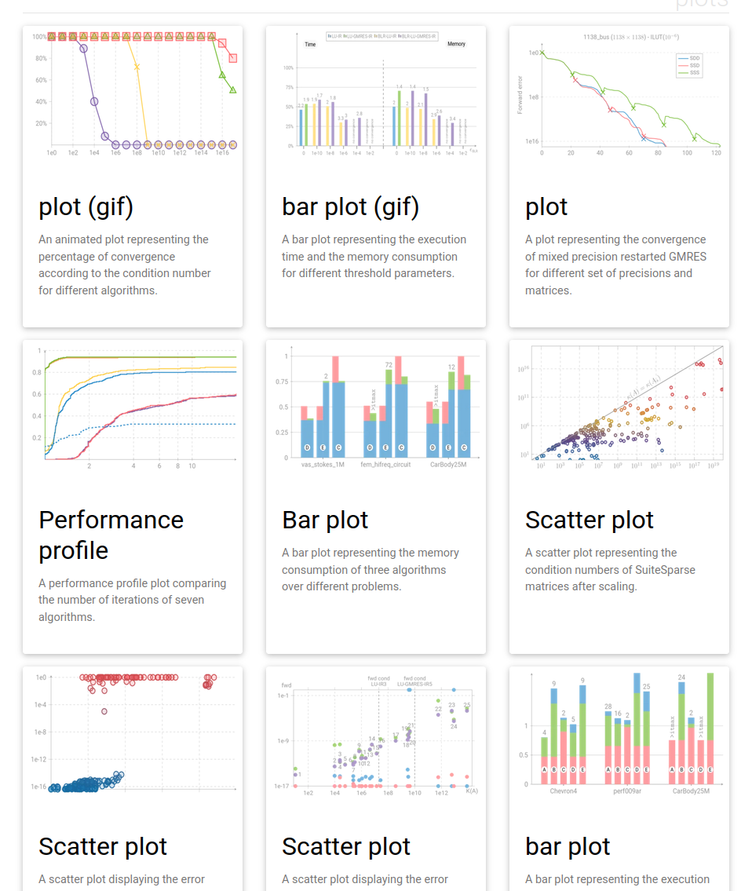
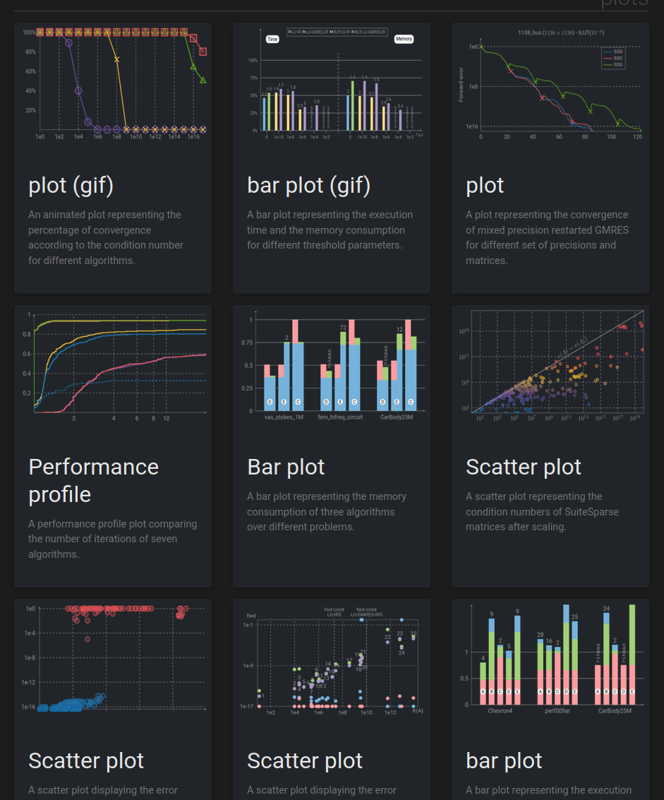

# TeXFantasy

TeXFantasy is a gallery of Latex figures that I used for various documents, 
from teaching materials to scientific journal articles. The gallery can be found
on my website: https://bvieuble.github.io/texfantasy/

  
   

I am opinionated on how figures and plots should be drawn, which should be of course in LaTeX, but I willingly admit that the learning curve for using these tools is steep. Even experienced Tikz/Pgfplots users will probably be slower in using Latex than using Matplotlib in Matlab for the plots. However, if you fall into this rabbit hole, you might never turn back.

I found for myself great help from Tikz galleries in the past to learn and know what was possible. We all begin with copy-pasting code, and this is even truer for Tikz and Pgfplots figures. So don't hesitate to help yourself with my code. I will complete my gallery as I draw new figures for articles, presentations, etc.
