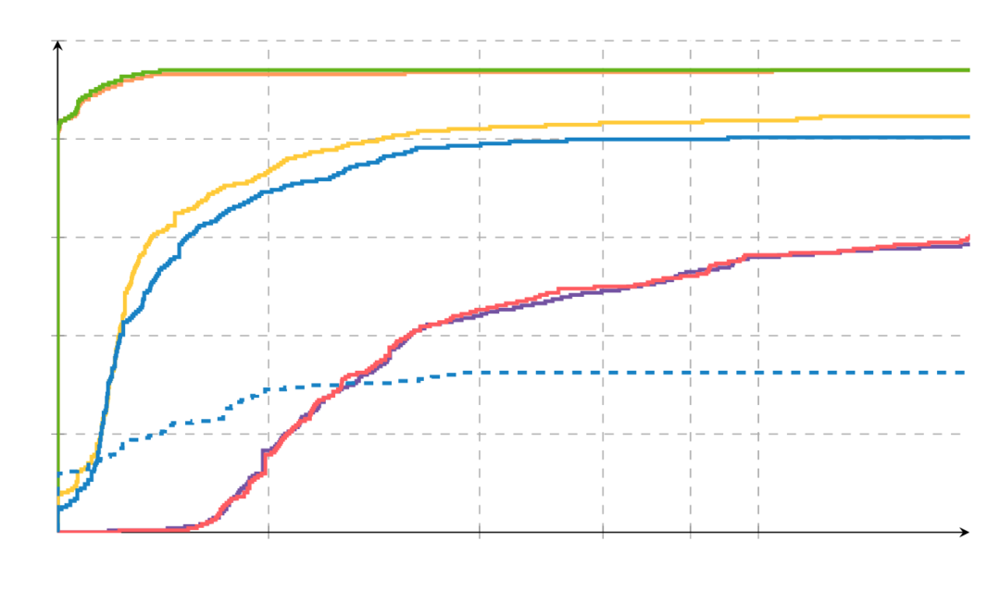
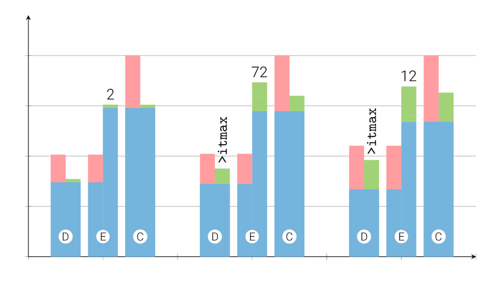
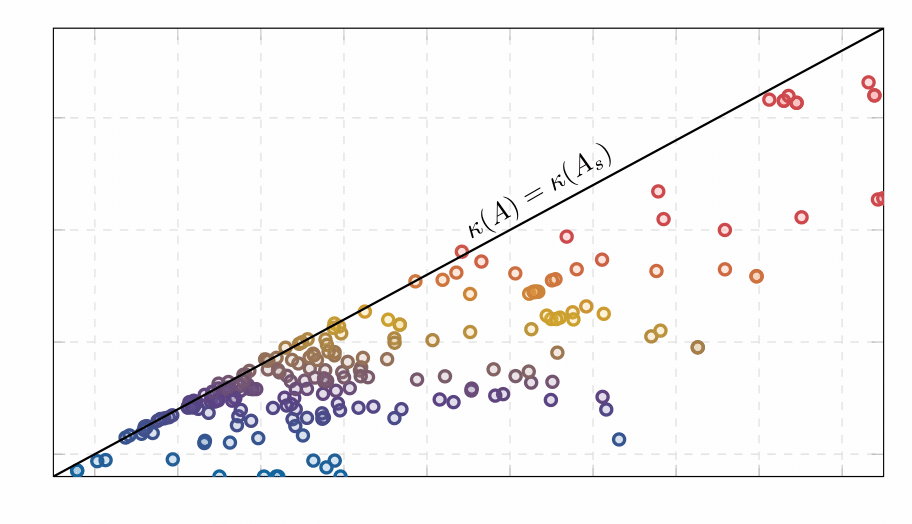
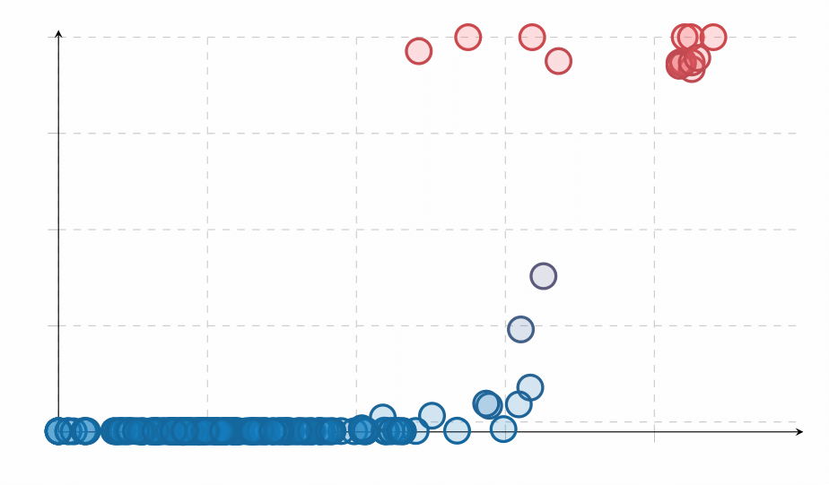
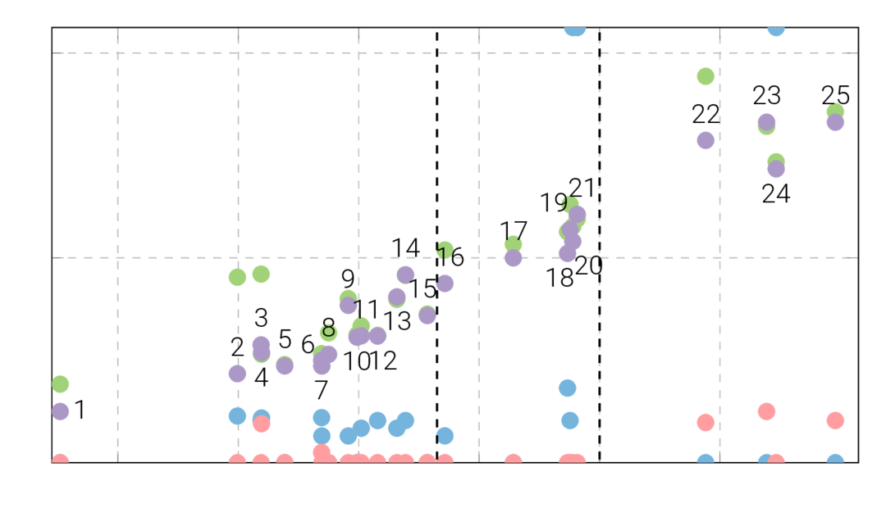
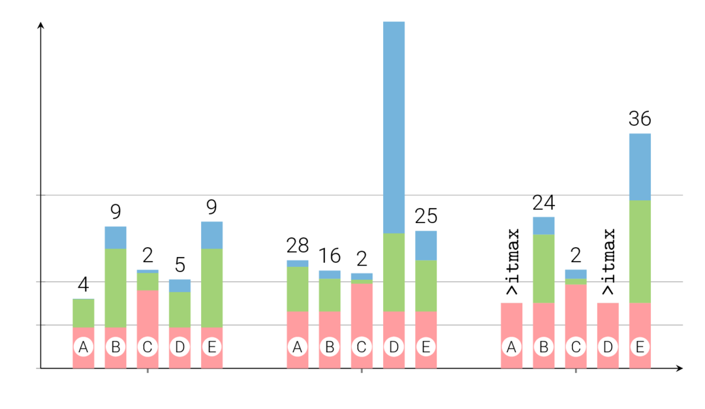
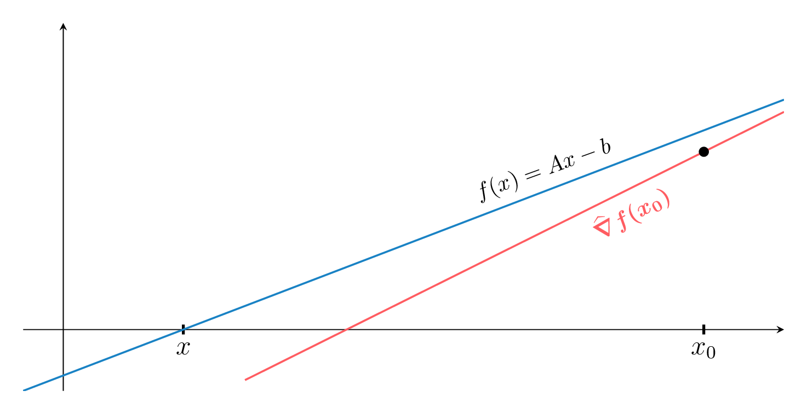
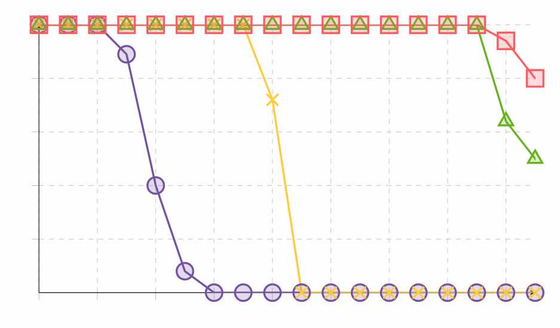
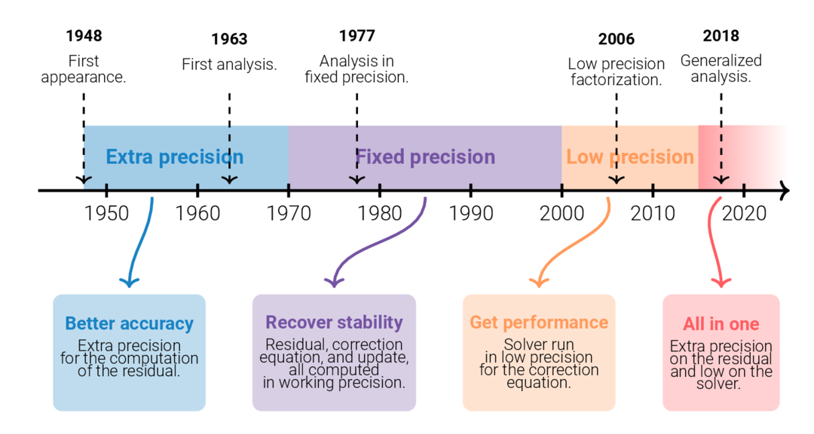

# TeXFantasy

TeXFantasy is a gallery of Latex figures that I used for various documents, 
from teaching materials to scientific journal articles. The gallery can be found
on my website: https://bvieuble.github.io/texfantasy/

  
   
   

  
   
   

  
   
   

I am opinionated on how figures and plots should be drawn, which should be of course in LaTeX, but I willingly admit that the learning curve for using these tools is steep. Even experienced Tikz/Pgfplots users will probably be slower in using Latex than using Matplotlib in Matlab for the plots. However, if you fall into this rabbit hole, you might never turn back.

I found for myself great help from Tikz galleries in the past to learn and know what was possible. We all begin with copy-pasting code, and this is even truer for Tikz and Pgfplots figures. So don't hesitate to help yourself with my code. I will complete my gallery as I draw new figures for articles, presentations, etc.

### Why plotting in LaTeX is cool!

LaTeX offers formidable ways to generate complex, net, and well-integrated plots for all your scientific documents. For me, its main appeal compared with the usual plot libraries of your favorite language (Julia, Python, Matlab, R, etc.) is that the background, fonts, and size of your figures automatically match your document's environment, giving it a nice professional look. 

And naturally, there are far more benefits. We could talk about the fun beamer animations you can make or the almost infinite customization possibilities. Trust me, once you fall into the rabbit hole of LaTeX-generated plots, you won't come back!

### Downsides
Naturally, the more the tool is complete, the harder it is to manage and use. The Pgfplots and TikZ packages are no exceptions to this rule, and while they do not require weeks and weeks of learning to be able to get something out of them, a beginner will certainly need a couple of hours to learn how to draw its first plots.

Another annoying aspect of generating plots with LaTeX, which can understandably repel users, is data-to-plot retrieval. Let me state the problem. Say you have a nice Matlab code that produces an array of points you want to display. Of course, LaTeX does not talk Matlab, and conversely, so there is no magic trick that will make your Matlab array suddenly readable by LaTeX. The bad news is, up until now, I have not encountered an ideal method to interface both nicely.

### Recover plot data with LaTeX, not an easy task...
The dummy solution is to copy your generated points by Matlab and paste them into your LaTeX document. I call this solution "dummy" because it is a little bit dangerous. Let me explain. In making scientific plots, we rarely generate the perfect set of points once. It is because you might discover bugs in the algorithm, take into account reviews, changes the parameters, etc. The thing is, in practice, the points will be plotted and displayed in a document multiple times. It means that you will need to copy/paste your points as many times manually... And if you forget to do so, which will certainly happen at some point, we have all rerun once in life our set of results at 2am in the morning and forgot to backpropagate, you might end up plotting the wrong set of points. It is not a harmless mistake if this plot is intended to be part of a scientific article that will be published. 

The less dummy solutions allow some sort of interfacing/automatization: if I regenerate the data with my Matlab code, my LaTeX documents use this up-to-date data to generate the figure when it is recompiled. Following this, there are two philosophies. You can use a Matlab script that produces the LaTeX figure files. The data is automatically inserted by Matlab in the LaTeX files. Or you can write your Matlab generated data in CSV files that can be read with the Pgfplotstable library of LaTeX. This last solution is the one I use personally.

