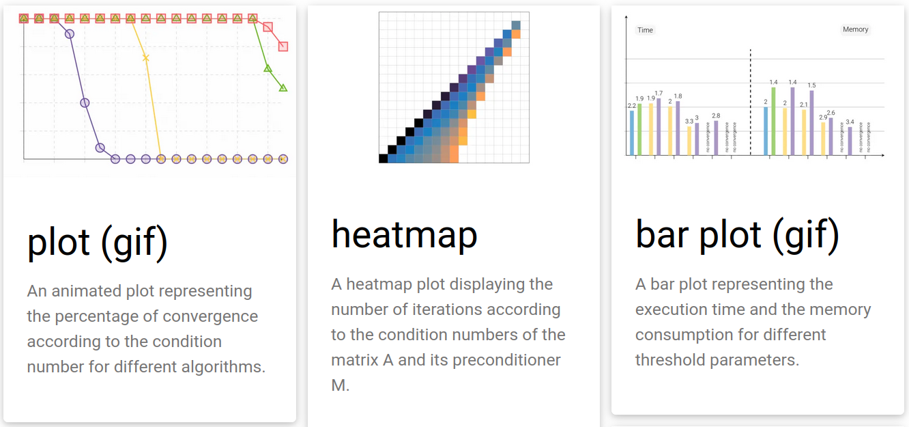
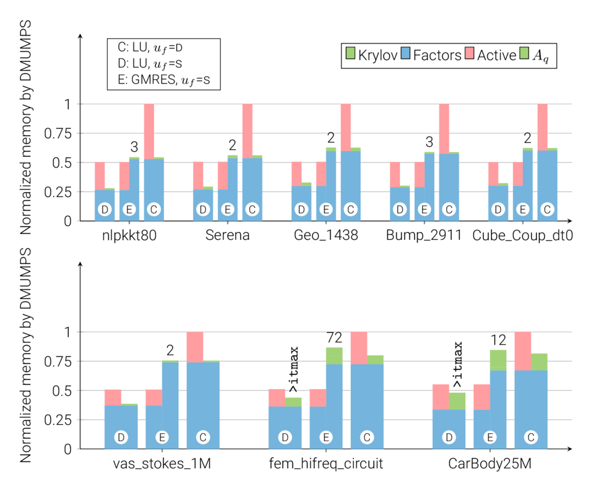

# TeXFantasy
A set of Latex figures that I used for various documents, from teaching 
materials to scientific journal articles.

This git repository contains the full code of the figures displayed on my
website: https://bvieuble.github.io

